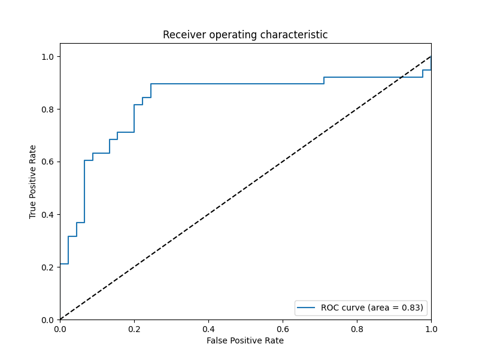
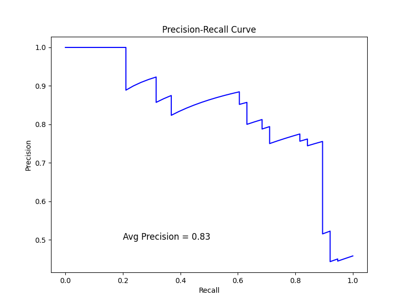

# Kidney Stone Prediction Classifier

## Overview

The Kidney Stone Prediction Classifier is a binary classification model developed to predict whether a patient is likely to have kidney stones based on various numerical features. This model aids healthcare professionals in making informed decisions for early detection and improved treatment outcomes.

## Dataset

The model has been trained on a dataset consisting of 414 entries, with a separate test dataset containing 276 entries. The dataset includes diverse information such as age, medical history, and other relevant factors, contributing to the model's ability to make accurate predictions.

## Code

The model is implemented in Python, leveraging popular libraries such as Pandas for data manipulation and Scikit-learn for machine learning functionalities. The code is well-organized, making it easy for developers and healthcare professionals to understand and potentially customize for specific use cases.

## Dependencies

- Python 3.x
- Pandas
- Scikit-learn

## Usage

1. Install the required dependencies:

    ```bash
    pip install pandas scikit-learn
    ```

2. Clone the repository:

    ```bash
    git clone https://github.com/shib1111111/Kidney-Stone-Prediction-Classifier.git
    ```

3. Navigate to the project file **"Kidney_Stone_Prediction_Classifier.ipynb"** and run the  scripts:


## Model Evaluation

The model's performance has been evaluated on a separate test dataset to ensure its reliability. Metrics such as accuracy, precision, recall, and F1 score are provided in the evaluation results.
## Sample Screenshots

<table align="center">
  <tr>
    <td></td>
  </tr>
    <tr>
    <td></td>
  </tr>
</table>


## Contributing

I welcome contributions to enhance this repo. Feel free to open issues or submit pull requests.

## License

This project is licensed under the [MIT License](LICENSE).

Thank you for viewing this repo! Feel free to reach out with any questions or feedback.

<em style="color: #ff66b2; font-weight: bold;">✨ --- Designed & made with Love by Shib Kumar Saraf ✨</em>
